# Variable Availability Plots

## AtmRivers
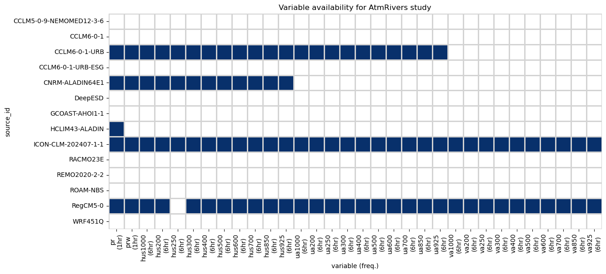

## Circulation
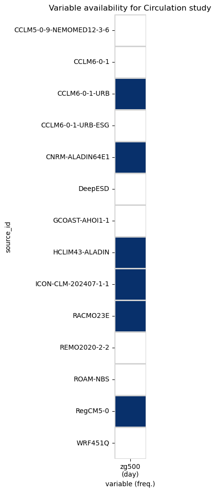

## ClimateClassification
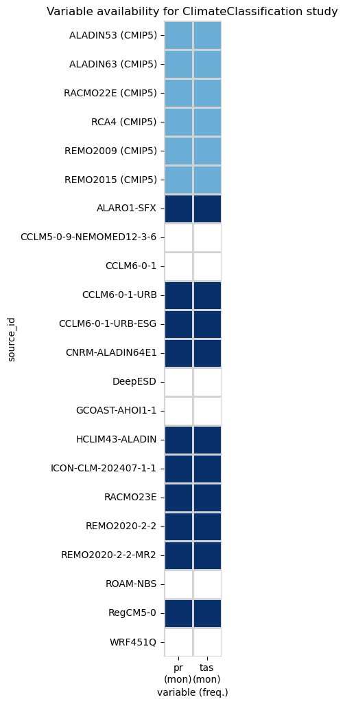

## ClimateServicesPrio1
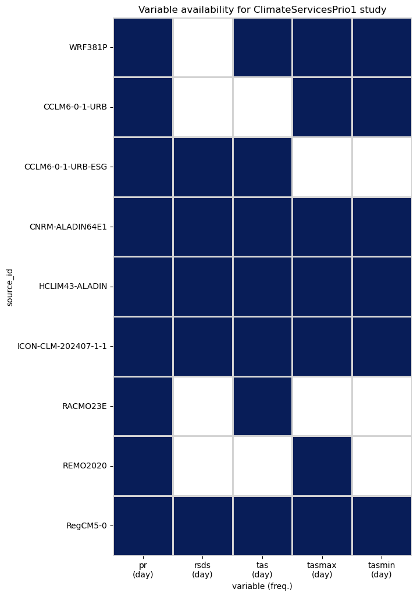

## ClimateServicesPrio2

## Droughts
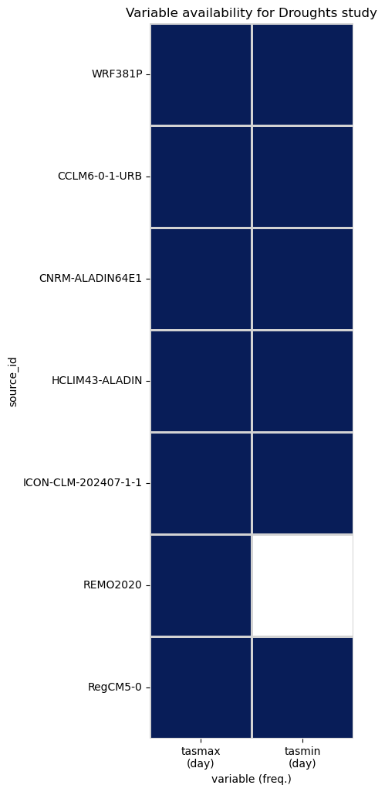

## Elevation
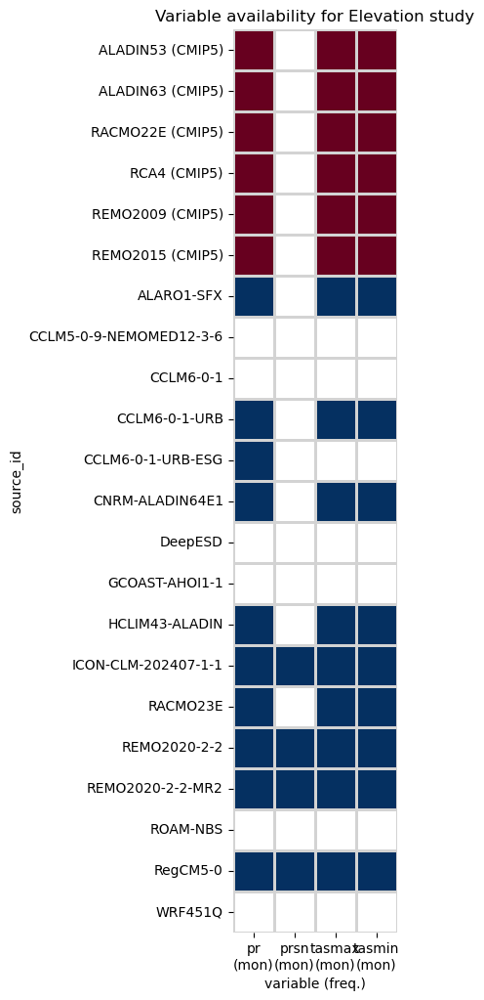

## FWI
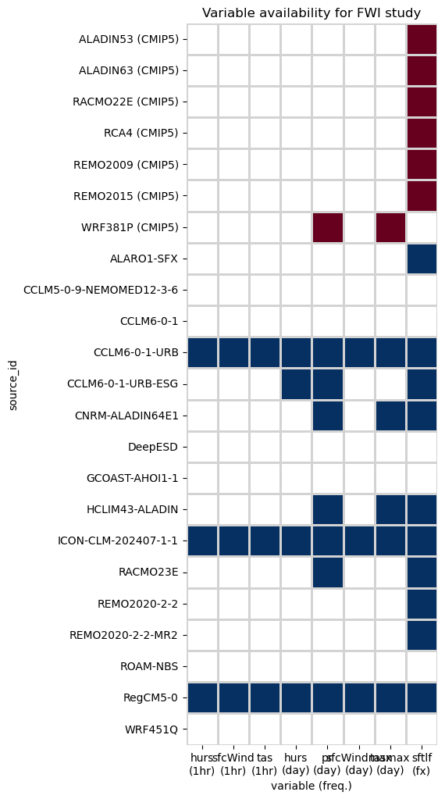

## HeatStress
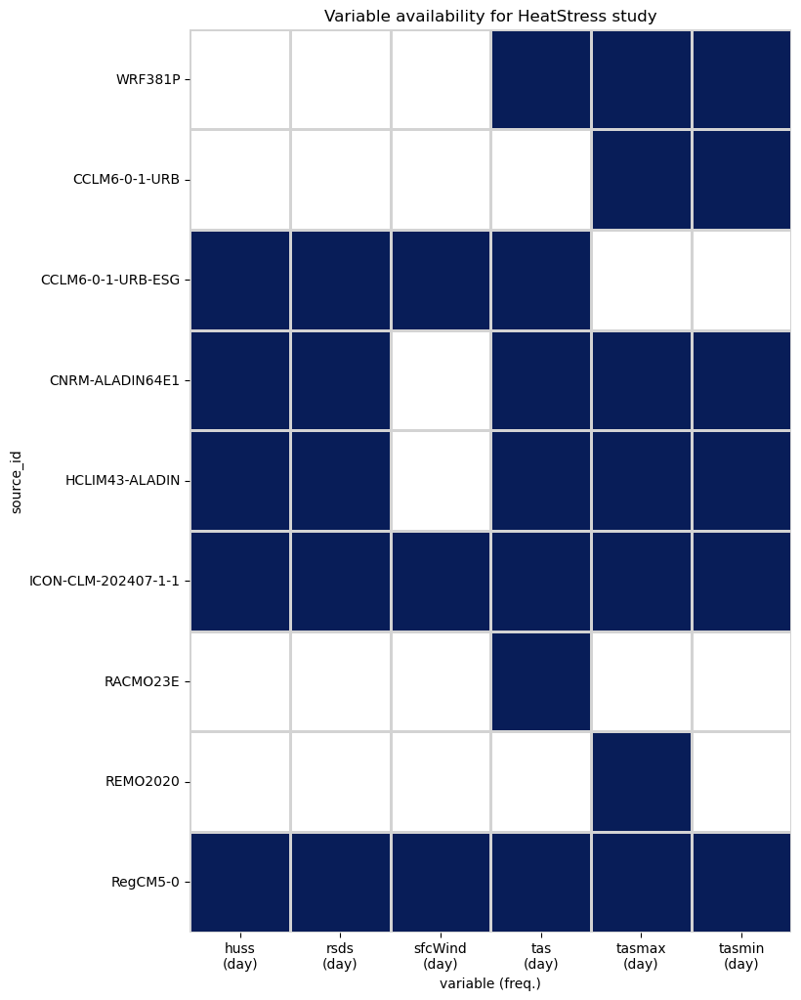

## Multifeature
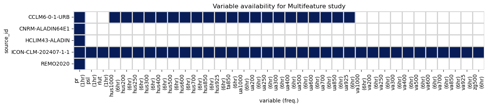

## Overview
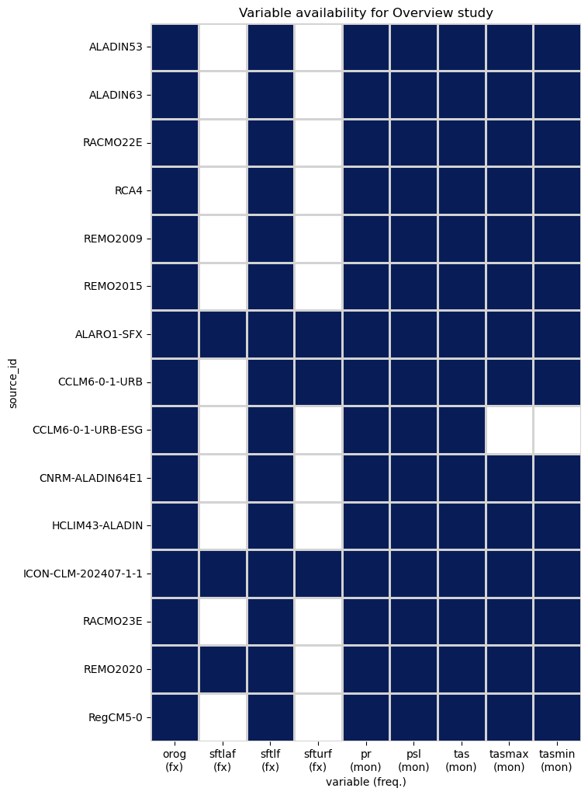

## PrecipExtremes
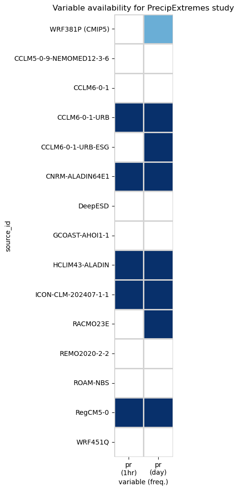

## Snow
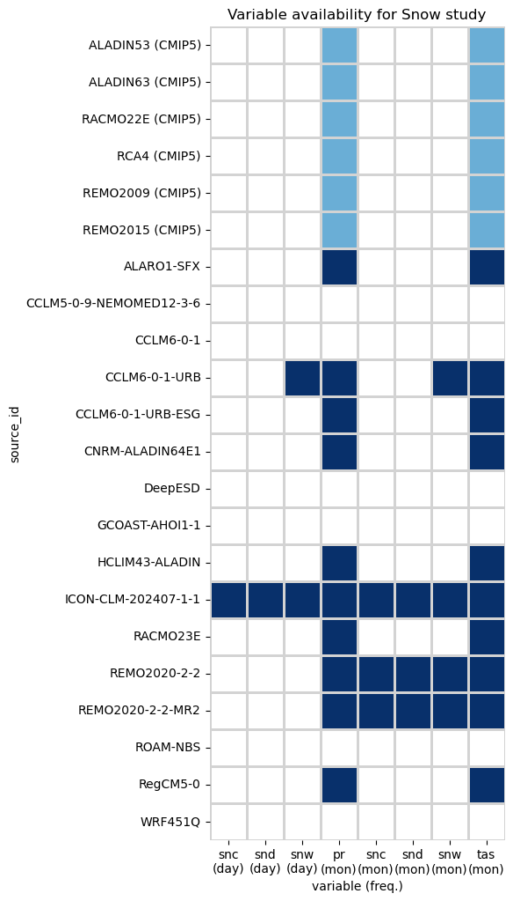

## Trends
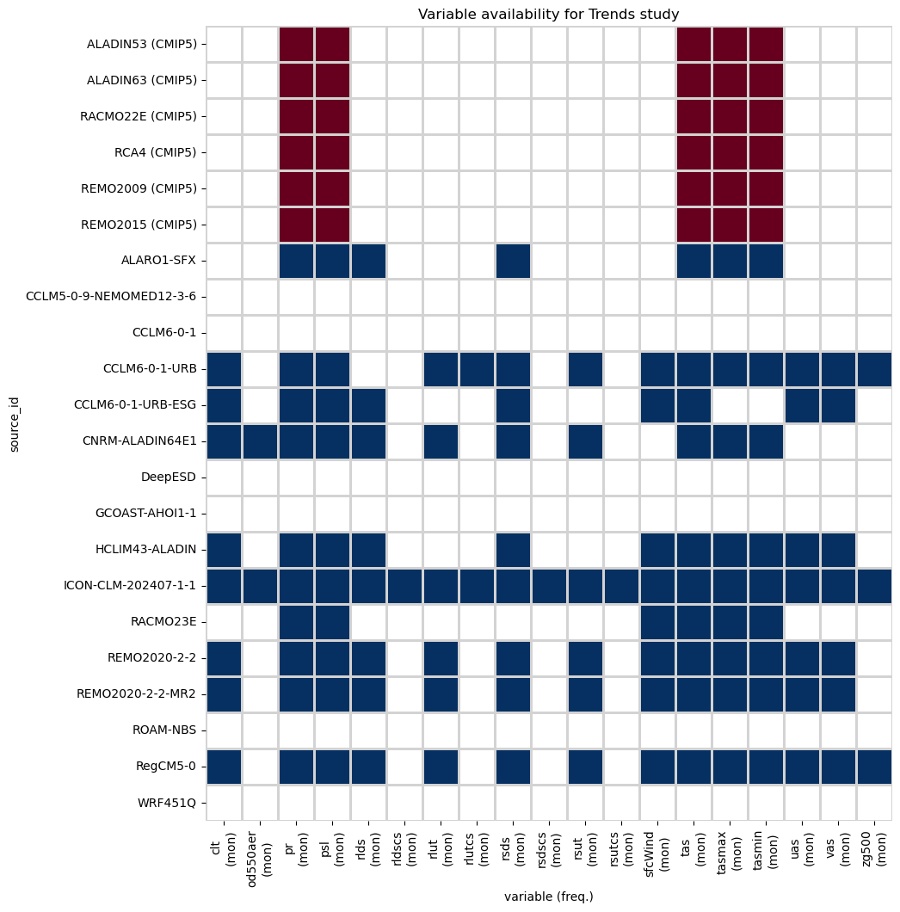

## WaterBudget
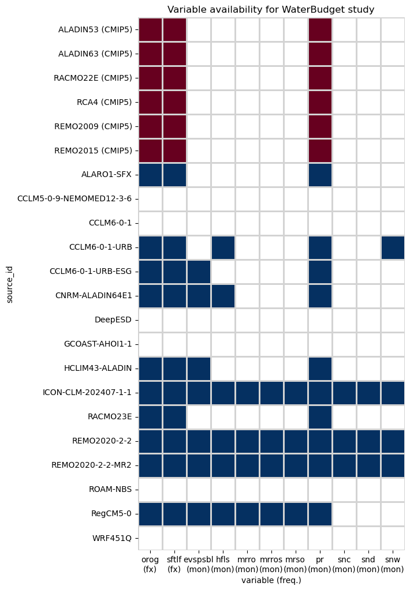
