# Variable Availability Plots

## AtmRivers
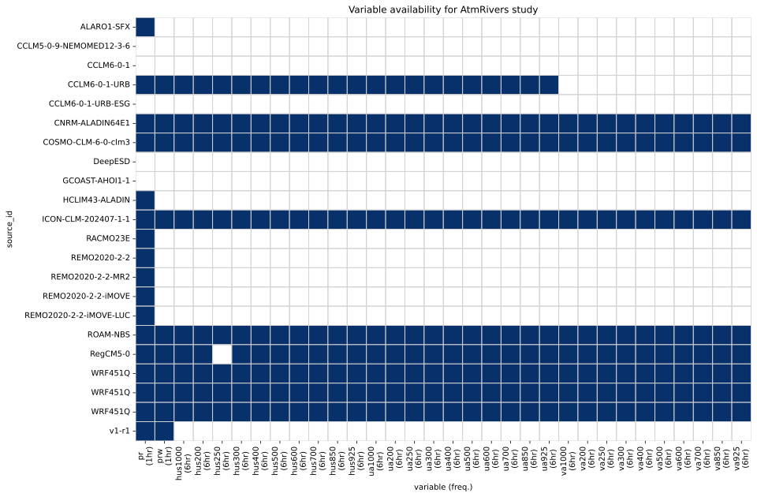

## Circulation
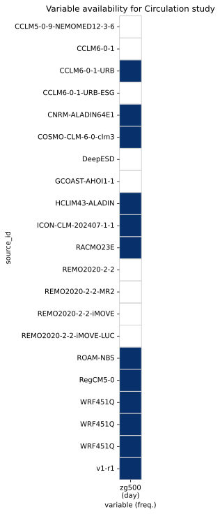

## ClimateClassification
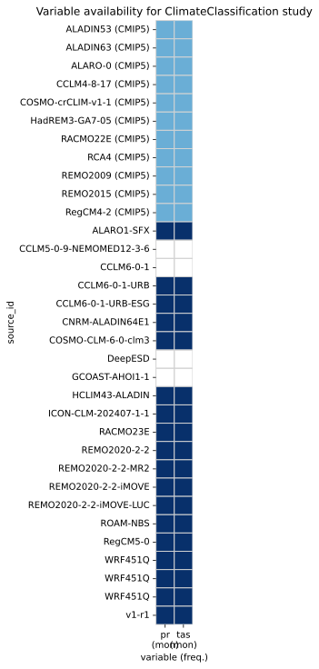

## ClimateServicesPrio1
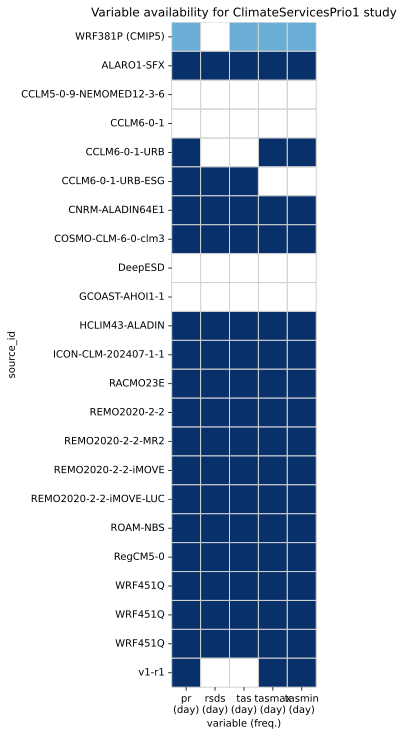

## ClimateServicesPrio2
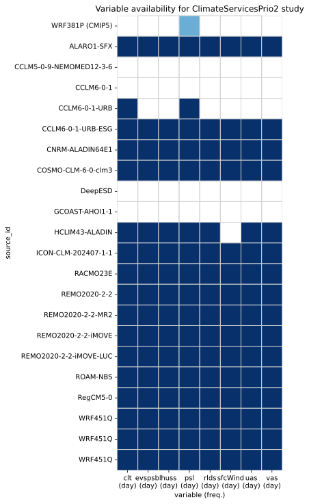

## Droughts
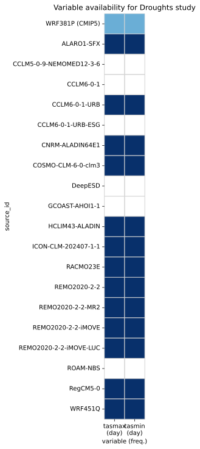

## Elevation
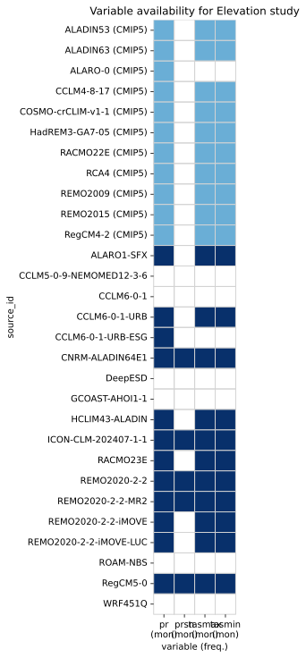

## FWI
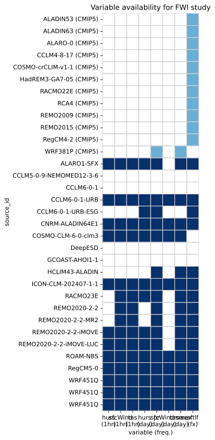

## HeatStress

## Multifeature
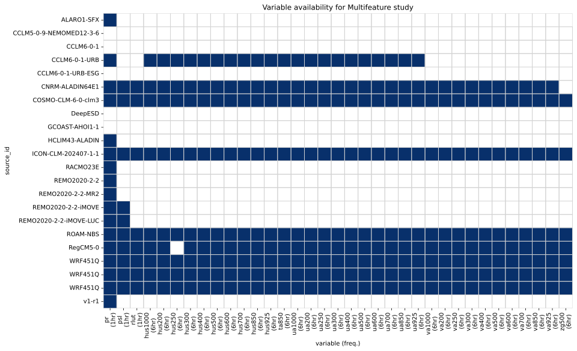

## Overview
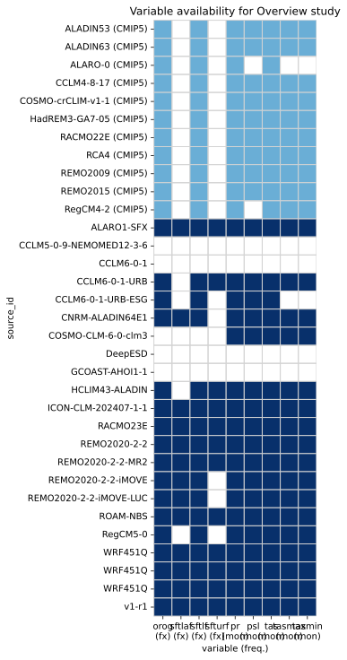

## PrecipExtremes
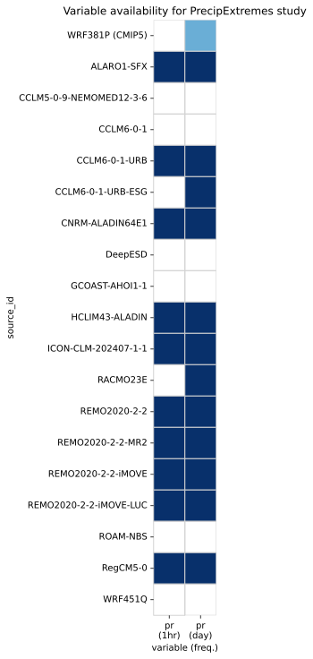

## Snow
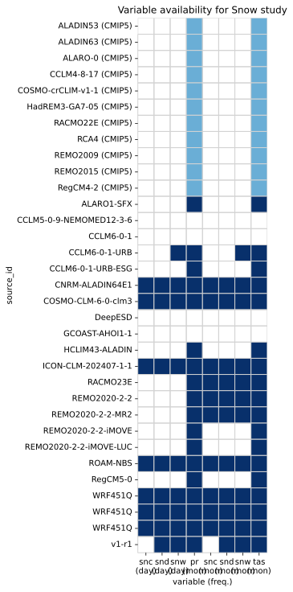

## Trends
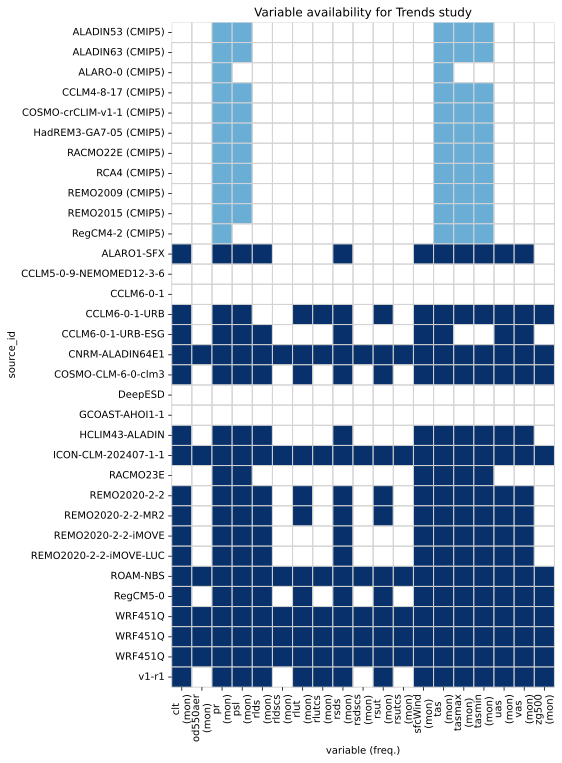

## Urban
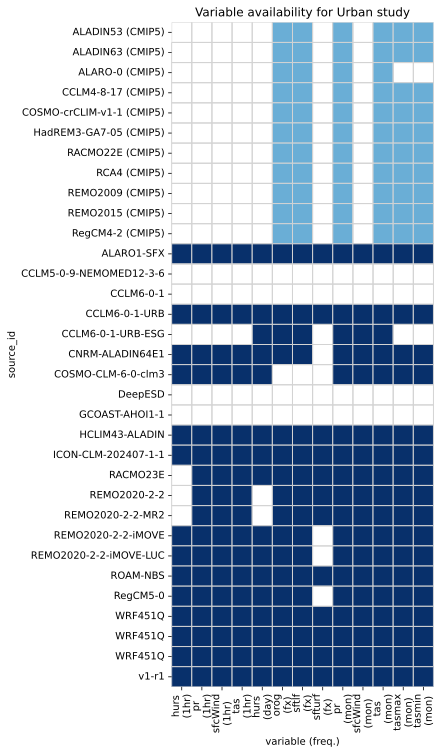

## WaterBudget
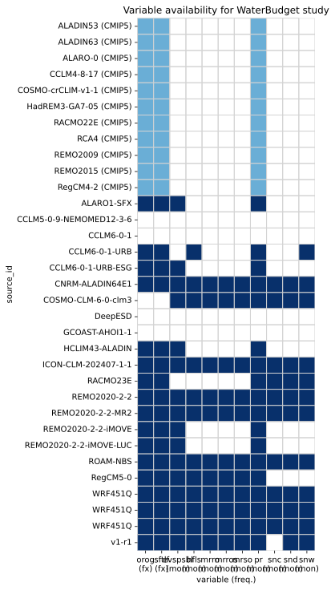

## WindEnergy
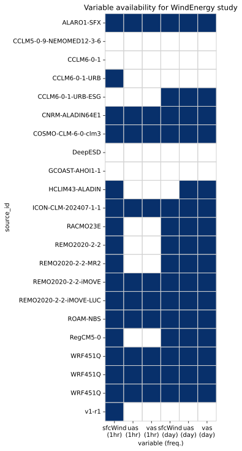
