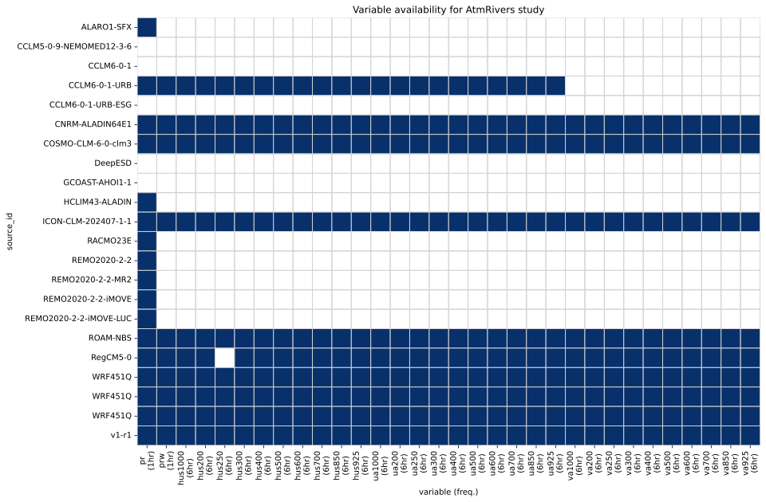
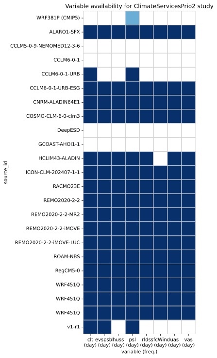
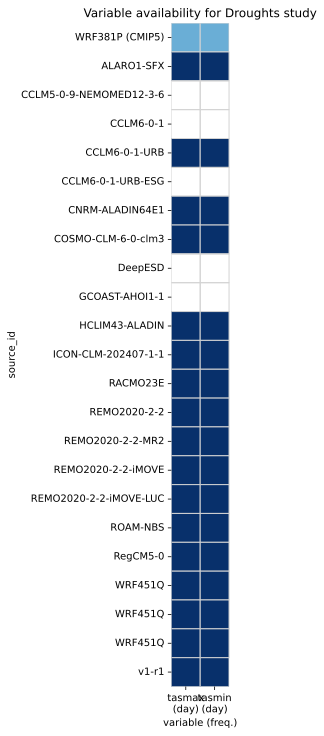
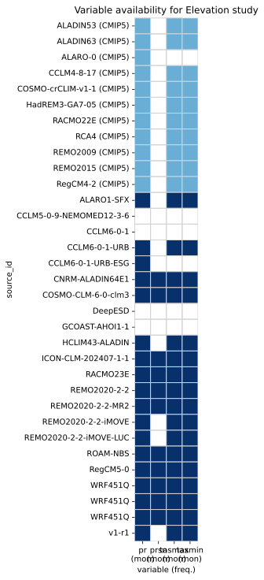
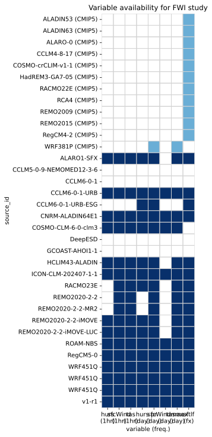
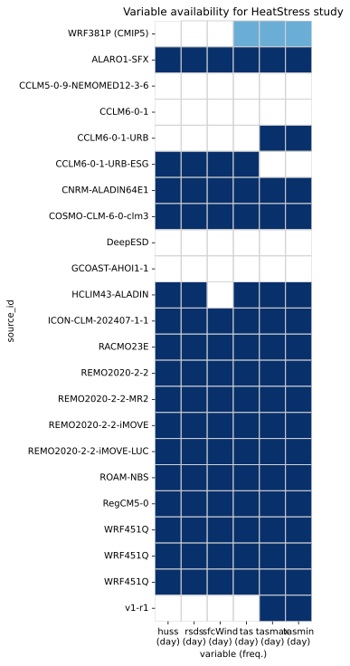
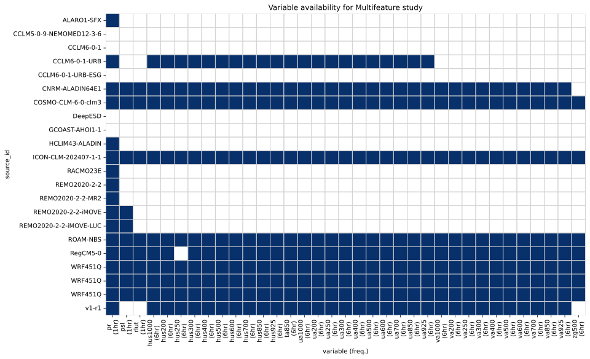

# Variable Availability Plots

## AtmRivers

## Circulation

## ClimateClassification

## ClimateServicesPrio1

## ClimateServicesPrio2

## Droughts

## Elevation

## FWI

## HeatStress

## Multifeature

## Overview

## PrecipExtremes

## Snow

## Trends

## Urban

## WaterBudget

## WindEnergy

